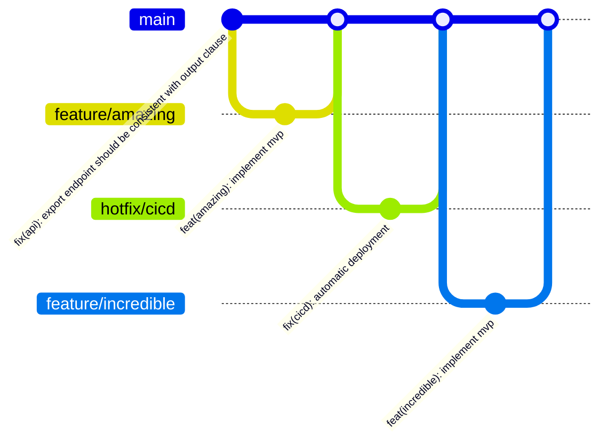

<p align="center">
  
</p>

[](https://parceljs.org/getting-started/library/)
[](https://standardjs.com)
[](https://nodejs.org/api/test.html)
[](https://github.com/features/security)
[](https://codeql.github.com/)
[](http://commitizen.github.io/cz-cli/)
[](https://semantic-release.gitbook.io/semantic-release/)
[](https://coveralls.io/)

# About

`@looplex/workflows` plays an important role in our platform engineering mission. It's a components library with reusable functionality required in our workflows module.

# Features

- [Modern Build Tool](https://parceljs.org/getting-started/library/)
- [Native Assertion Module](https://nodejs.org/api/assert.html)
- [Native Test Runner](https://nodejs.org/api/test.html)
- [Native Watch Mode](https://nodejs.org/docs/v20.12.1/api/test.html#watch-mode)
- [Built-in Software Composition Analysis (SCA)](https://github.com/dependabot)
- [Built-in Static Application Security Testing (SAST)](https://codeql.github.com/)
- [Enforced Coding Standard](https://standardjs.com/)
- [Enforced Conventional Commits](https://www.conventionalcommits.org/en/v1.0.0/)
- [Enforced Semantic Release](https://semver.org/)

# Usage

`@looplex/workflows` is available and ready for use on workflows enviornment. But if, for some reason, you want to leverage it as a standalone, the easiest way to install is by running:

```bash
npm install @looplex/workflows
```

# Standards and Rules

| Context                                |                            Specification                             |
|:---------------------------------------|:--------------------------------------------------------------------:|
| Storing and Sharing **Date and Time**  | [ISO 8601 Z](https://www.iso.org/iso-8601-date-and-time-format.html) |
| Storing and Sharing **Country Codes**  |     [ISO 3166](https://www.iso.org/iso-3166-country-codes.html)      |
| Storing and Sharing **Language Codes** |     [ISO 639-1](https://www.iso.org/iso-639-language-codes.html)     |
| Storing and Sharing **Currency Codes** |     [ISO 4217](https://www.iso.org/iso-4217-currency-codes.html)     |
| Runtime **Charset**                    |                            UTF-8 (65001)                             |
| Runtime **Language Code**              |                             en-US (1033)                             |

# Contributing

We welcome contributions! Contributions are what make the open source community such an amazing place to learn, inspire, and create. Any contributions you make are **greatly appreciated**.

If you have a suggestion that would make this better, please fork the repo, make changes and create a pull request. You can also simply open an issue with the tag "enhancement". Don't forget to give the project a star! Thanks again!

This GitHub repository adheres to the principles of [GitHub Flow](https://docs.github.com/en/get-started/using-github/github-flow) as outlined in the official GitHub documentation. We ensure that all changes are made through branch-based workflows, enabling collaborative development and efficient code review before integration into the main branch.



1. Fork the Project
1. Create your Feature Branch (`git checkout -b feature/amazing`)
1. Commit your Changes (`npm run commit`)
1. Push to the Branch (`git push origin feature/amazing`)
1. Open a Pull Request

# Maintainers

As soon as the maintainers are satisfied with the feature set to be released, they should:

1. Evaluate the quality of the package through the bundle-analyzer report.
1. Run `npm run release`.
1. Confirm if the package is available in npm as the latest version.
1. Notify the maintainers of project embedding this library for faster adoption.

# License

This project is licensed under the Looplex Limited Public License. Feel free to edit and distribute this template as you like.

See [`LICENSE.md`](/LICENSE.md) for more information.

# Acknowledgments
* Special thanks to CEO Angelo Caldeira for enabling this initiative and to our CTO [Fabio Nagao](https://github.com/nagaozen/) who created the framework of this library.
* Shoutout to [looplex contributors](https://github.com/orgs/looplex/people) for their outstanding effort on releasing open source software.

# Useful links
* [README logos](https://stock.adobe.com/br/contributor/208853516/hasan?load_type=author) -- logos repository with the same pattern we are using.
* [Simple Icons](https://simpleicons.org/) -- `shields.io` badges icons and colors.
* [JSDoc Reference](https://www.typescriptlang.org/docs/handbook/jsdoc-supported-types.html) for great DX without enforcing a transpilation.
* [OWASP Application Security Tools](https://owasp.org/www-community/Free_for_Open_Source_Application_Security_Tools)